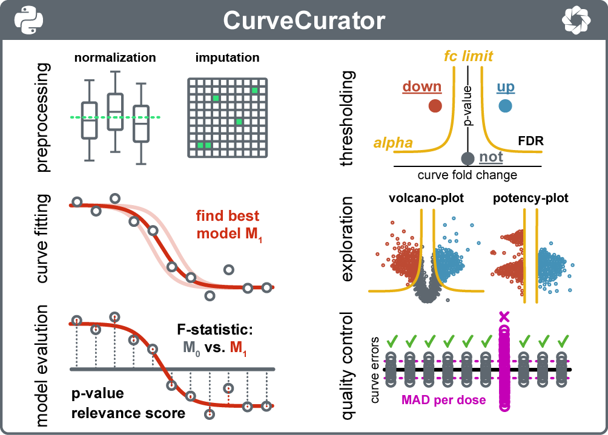

[](https://doi.org/10.1038/s41467-023-43696-z)
[](https://analyticalscience.wiley.com/content/article-do/statistical-analysis-dose-response-curves)
[](https://doi.org/10.5281/zenodo.8399823)
[](https://badge.fury.io/py/curve-curator)


# CurveCurator

CurveCurator is an open-source analysis platform for dose-dependent data sets. It fits a classical 4-parameter equation to estimate effect potency, effect size, and the statistical significance of the observed response. 2D-thresholding efficiently reduces false positives in high-throughput experiments and separates relevant from irrelevant or insignificant hits in an automated and unbiased manner. An interactive dashboard allows users to quickly explore data locally.

For more information, we refer to the paper. Especially the supplementary notes contain many explanations and tips and tricks for your data analysis strategy, which is dependent on the specific data set that you obtained. You may also have a look at the example datasets (including replicate analyses) and the example toml files.

If you used CurveCurator for your scientific work, please cite: Bayer et al. (2023), Nature Communications, 14(1), 7902.

If you have further questions, found a bug, or have great ideas to improve CurveCurator, we are asking you to leave an issue message so that we can constantly improve together.

## Table of Contents  
* [Installation](#installation_toc)  
* [Preparation](#preparation_toc)
  * [Raw data](#rawdata_toc)
  * [Toml parameter file](#tomlfile_toc)
* [Run Pipeline](#executaion_toc)
* [Dashboard Overview](#dashboard_toc)
* [FAQ](#faq_toc)


<a name="installation_toc"/>

## Installation:

#### 1. Install the virtual environment manager anaconda to install CurveCurator and its dependencies safely.
If you have anaconda already installed on your computer, you can move to step 2. If you still need anaconda, please go to the website (https://www.anaconda.com/) and download the newest version for your operating system. With the anaconda installation, you get an "Anaconda Prompt". This shell will be needed to install and execute the program later. If you are more advanced, you can use other shells too.

#### 2. Install a new environment for CurveCurator in the shell.
Open the "Anaconda Prompt" program. Installation of the environment is only required once. Type the following command into the shell:
```sh
(base)$ conda create -n CurveCuratorEnv pip python=3.12
```
This will create a new environment with the name CurveCuratorEnv. In this environment, it will install the "pip" software and python version 3.12. It will ask you to confirm the installation of some packages for pip. If you have an environment with the same name already created or you prefer a different name, you must either delete it or create an environment with a different name. Please remember the name of the environment. For more information, see the anaconda documentation.

#### 3. Activate the CurveCuratorEnv environment
Activation of the curve_curator environment is always required each time you open a new shell and must be done before you run the pipeline (see section "Run pipeline").
```sh
(base)$ conda activate CurveCuratorEnv
...
(CurveCuratorEnv)$
```
Successful activation is confirmed by seeing the name of the current environment in the braces before the $.

#### 4. Install CurveCurator and its dependencies in the CurveCuratorEnv
We have registred CurveCurator in PyPi (https://pypi.org/project/curve-curator/). This allows fast installation of the latest stable version using the following pip command. Make sure you are in the correct environment.
```sh
(CurveCuratorEnv)$ pip install curve-curator
```
Verify installation by seeing that the program exists. If everything was done correctly, you will see the help output of CurveCurator (as shown below) and you are done with the installation.
```sh
(CurveCuratorEnv)$ CurveCurator -h
...
usage: CurveCurator [-h] [-b] [-f] [-m] [-r [RANDOM]] <PATH>

CurveCurator

positional arguments:
  <PATH>                Relative path to the config.toml or batch.txt file to run the pipeline.

options:
  -h, --help            show this help message and exit
  -b, --batch           Run a batch process with a file containing all the parameter file paths.
  -f, --fdr             Estimate FDR based on the target decoy approach. Estimating the FDR will double the run time.
  -m, --mad             Perform the medium absolute deviation (MAD) analysis to detect outliers
  -r [RANDOM], --random [RANDOM] Run the pipeline with <N> random values for H0 simulation.
```
If you see instead the message: " 'CurveCurator' is not recognized as an internal or external command, operable program or batch file" or any other error, then there was a problem during the installation. Also, double-check that you are in the correct environment.

If you want to update CurveCurator to the latest version after you have installed it already, redo the pip install of step 4.

<a name="preparation_toc"/>

## Preparation:

<a name="rawdata_toc"/>

#### 1. Prepare the raw data
CurveCurator can deal with various different dose-dependent data formats and provides different customizable parsers.
In essence, each file is a tab ("\t") separated file with data columns that have specific columns names that match to the parameter.toml file setup (see below point 2).

We provide a detailed description for different data parser modes, how the data needs to be formatted accordingly, and how CurveCurator aggregates data in the [data folder](example_datasets/). If you have further questions you can always reach out for help here on GitHub.


<a name="tomlfile_toc"/>

#### 2. Fill out the parameter toml-file for each dataset
Each dataset comes with a parameter file in TOML format. This file contains all necessary information for each experiment / raw input as well as optional parameters so that users can adjust the pipeline specifically to an experiment.

For more information, please check out the [toml folder](example_toml_files/). We provide there a detailed description of each toml parameter as well as example files that can be a starting point to setup the perfect CurveCurator pipeline for your data. If you have further questions you can always reach out for help here on GitHub.


<a name="executaion_toc"/>

## Run pipeline
There are multiple modes to execute CurveCurator:

#### Mode 1. Run the pipeline script for one dataset
The standard way of running the script is shown below. All necessary information is provided via the toml file. Make sure that you are in the correct environment, which is called 'CurveCuratorEnv' if you have followed the installation guide.
```sh
(base)$ conda activate CurveCuratorEnv
(CurveCuratorEnv)$ CurveCurator <toml_path>
```
There are optional parameters to enable additional analysis steps. If the FDR option is activated, Curve Curator will generate decoys based on the data input and estimate the false discovery rate (FDR) for the user-given alpha and fold-change additionally. If the MAD option is activated, the noisy channel detection is performed additionally.
```sh
(CurveCuratorEnv)$ CurveCurator <toml_path> --fdr --mad
```

#### Mode 2. Run the pipeline script for many datasets as batch
The batch_file is just a txt file containing a list of toml file paths that will be processed consecutively. FDR and MAD parameters can be activated optionally.
```sh
(CurveCuratorEnv)$ CurveCurator --batch <batch_file> --fdr --mad
```

#### Mode 3. Run the pipeline with simulated data
If you apply non-standard settings and want to experiment with F-value distributions under the H0=true, you can simulate your own distributions. N indicates the number of curves you want to simulate. The generated data will be saved as the input file specified in the toml file.
```sh
(CurveCuratorEnv)$ CurveCurator <toml_path> --random <N>
```

<a name="dashboard_toc"/>

## Explore data with the interactive dashboard

CurveCurator provides the user with an interactive dashboard. Different functionalities are accessible depending on the specific dataset. All dashboards consist of a global plot on the left side (either volcano plot view or potency plot view), a dose-response curve area in the middle showing selected curves, data selection tools, and a data table giving more information about selected items. Each plot has a toolbar (upper right corner) that allows for data engagement, such as panning, tap or lasso selection, resetting, and saving. Please note that the toolbar can be further customized by slowly clicking on the icon and selecting the custom mode type from the appearing selection box. Thanks to the hover tool, a small information box appears, showing the name of the dot/curve. There are also a few keyboard shortcuts e.g., multi-selection (click with SHIFT) and de-selection (click with ESC). For more in-depth information, please visit the bokeh documentation. Data from the HTML file cannot be deleted or altered. Refreshing the browser will revert all adjustments, filters, and selections to the default. If a particular representation is of interest, it can be exported as a figure via the save tool. On smaller laptop screens, it is possible that the canvas width exceeds the screen width. Unfortunately, bokeh cannot rescale the width automatically. There are two possibilities to deal with this situation: 1) You either accept it and scroll left and right to plots of interest; or 2) you zoom out until it matches your screen. A quick reload of the HTML page in the browser will remove the blurriness that may arise as a consequence of rescaling.

The **Volcano plot** relates the Log2 - Curve Fold Change (CFC) vs. the Curve Significance (-log10 p-value) or Curve Relevance Score (CRS). Each dot is one dose-response curve, and the color indicates its potency. Negative CFC values indicate down-regulation and positive CFC values indicate up-regulation. Please remember that the CFC is normally defined as the log2 ratio between the lowest and highest concentration - not to the control - unless you actively change this via the toml parameter "control_fold_change=true". The x and y axes automatically scale to the data, showing the complete range of values in the dataset. The red line shows the decision boundary, which was constructed based on the toml file (alpha & fc_lim asymptotes). One can hide or show curves using the all/regulated/not-regulated toggle at the top. By clicking on a curve(s), the volcano plot shows that it was selected by blurring the non-selected dots. Simultaneously, the selected curve appears in the dose-response area and in the table. In the volcano plot view, there are additional buttons next to the view toggle that allow you to switch between p-values and relevance scores. The relevance score is based on the s0 SAM statistic and describes the statistical significance and the biological relevance in a single number. If specified in the toml file, other p-value adjustment techniques can be used instead of the relevance score. Here, the p-value and fold change cutoffs are two independent boundaries.

The **Potency plot** relates the Curve Fold Change (CFC) vs. the Curve Potency (pEC50). It can be accessed via the drop-down menu at the top. By default, only significant curves are shown since only those pEC50 values can be interpreted. Please never interpret curve estimates from insignificant curves. Hovering, clicking, and other functionalities are identical to the Volcano plot.

The **Dose-Reponse Curve area** plots only selected curves and yields a quick overview of the raw data and the fitted curve. There is no other functionality. The curves can be exported.

The **Histogram area** displays a few extra values (when present in the input data), which can be helpful in interpreting specific curves. When a curve is selected, a red line indicates where in the distribution the selected curve is located. Again, hovering will show the name of the curve. The black dashed lines indicate the current selection thresholds, which are additionally applied to the data set (see below) to focus on a specific subset of curves.

The **Curve Selection area** helps to select and filter curves. Depending on the different dataset types, sliders filter for a subset of curves (pEC50, Score, Signal). Curves that are not within the selected range will become invisible. The thresholds are indicated in the histograms corresponding to the slider. Below the sliders, there are search fields for selecting curves by strings. In fact, these are regex-compatible search strings, allowing for complex querying of the data. For example, all peptide sequences containing the motive of a proline-driven serine-threonine kinase can be selected and visualized by searching the sequence against `[S|T]\(ph\)P`. Please have a look at Python regex notations for more details. Please also note that hidden/filtered/deselected curves cannot be (re-)selected via the search fields. Only curves that are displayed in the Volcano or Potency plot are selectable. If you are looking for a curve that is hidden for some reason, you need to remove the filters (sliders or regulations) first.

The **Table** provides more detailed information about each curve. By clicking on the table's headers, it can be sorted alpha-numerically. By clicking on a table row, only the specific row will be selected, and the rest will be de-selected. When holding the ctrl-key while clicking, only this row is de-selected, and the rest stays selected.


<a name="faq_toc"/>

## FAQ:
Q: The regulation column in the curves files has categories up, down, not. However, many rows are not classified into these categories. Why? and How should I interpret this?

A: Unclassified curves should be treated very carefully. In principle, there are two reasons why a curve regulation type could not be determined. First, the curve is too noisy. There is no apparent regulation, but the data points are so scattery that one should simply not interpret anything here. Second, the curve has low noise but also exhibits some sort of faint regulation; just the fold change was not big enough to render it relevant. However, it would be an overinterpretation to call these curves not regulated. The `not_rmse_limit` parameter can tune how much noise the not classification can tolerate. The `alpha` and `fc_lim` parameters control how much noise the down and up can tolerate and how much effect is required.

Q: How to deal with replicated doses in one experiment?

A: Curve curator can deal with replicated data. It is also possible to have only replicated controls and no replicates for the same doses. There are different possibilities for handling replicates in CurveCurator. 1) It's possible to get a single curve from replicated data where the replicated doses were aggregated to a single average point before the fitting. 2) It's possible to get a single curve with all replicated ratios being fitted simultaneously. In the dashboard, you are able to see all individual observations around the estimated curve. 3) It's possible to get an independent curve fit for each replicate experiment. Depending on the selected strategy 1-3, the data structure and the toml file need to be adapted accordingly.

Q: What is the Relevance Score?

A: After fitting the curve model to the observed response, CurveCurator calculates an F-value and p-value for each regression curve. The user has then defined an alpha threshold (to control statistical significance, `alpha`) and a fold change threshold (to define biological relevance, `fc_lim`) that are both used to find high-quality curves in the dataset. The relevance score combines these two properties of significance and biological relevance into a single number for each curve. Consequently, the previous hyperbolic decision boundary in the classical volcano plot will be a single relevance threshold in the alternative volcano plot after the transformation.

Q: What is the difference between global and filtered FDR? How is it calculated? Should I adjust to a preset FDR value, e.g. 5%?

A: CurveCurator calculates the false discovery rate (FDR) by generating decoy curves, if you activate the `--fdr` option in the command line. Decoy curves are false by definition and are simulated based on the estimated measurement variance of the entire experimental dataset. The number of decoy curves that pass the relevance boundary gives an estimate of the expected number of false positives in the experimental data. This is the "global FDR" that CurveCurator reports in the fdr.txt file. If you specify additional curve filters, e.g. a pEC50 filter, experimental and decoy curves will be subject to these additional filters. The resulting "filtered FDR" is also reported in the fdr.txt file. Since the FDR is a function of the relevance score, which depends on both the alpha limit and fold-change limit, changing the threshold to a predefined FDR will inevitably change both limits. Typically, the FDR is quite low after the relevance procedure, and by increasing the FDR, the biological importance gets weakened. In light of this, we recommend sticking to the alpha and fold change limit you set before and just being happy that you don't have a lot of false positives. If your FDR estimate turns out too high, keep the fold-change limit and increase the alpha stringency.

Q: Can CurveCurator deal with data other than dose-response data, such as temperature-response or time-response data?

A: CurveCurator was specifically optimized for dose-response data, where the response is typically expected to be sigmoidal in the log-transformed space. Other x-dimensions, such as time, can be processed and assessed principally, but CurveCurator will miss any non-sigmoidal behaviors. Furthermore, the x-dimension is currently always log10-transformed. If your data is sigmoidal in real space, you could pow10-transform the "doses" in the toml file to counteract the log10-transformation. We plan to make this more convenient in the future.

Q: Can I combine experiments with different doses into the same analysis run?

A: Unfortunately, this is not possible at the moment. Please split your data by experiment dose range and run them separately. We plan to make this more convenient in the future.

Q: Where can I get more information and help?

A: We added many additional information to the [supplementary text](https://static-content.springer.com/esm/art%3A10.1038%2Fs41467-023-43696-z/MediaObjects/41467_2023_43696_MOESM1_ESM.pdf 'supplementary text') of the original CurveCurator publication starting from page 13. If you have further suggestions or questions, please leave an issue message. We are happy to help you out.
