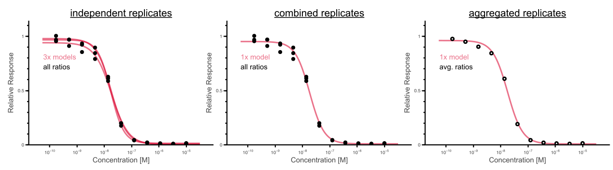

# Cell Viability Data


## Data set
The data set is based on the kinase inhibitor screen from Lee et al. (https://doi.org/10.1038/s44320-023-00004-7 - Supplement Table 4). 
It consists of 17 cell lines and 144 drugs in triplicates. 
Briefly, cells were seeded in 384-well plates 24 h prior to drug treatment. 
One DMSO control and 10 drug dilutions were incubated for 3 days, and viability was measured using the ATPLite assay following the manufacturer's instructions.

The output data of the different analysis strategies can be explored in the subfolders here. 

## Analysis strategies
CurveCurator enables three different ways to analyze the data: 
1. independent replicates
2. aggregated replicates
3. combined replicates



The input raw data and TOML file need to be adjusted according to the chosen strategy.
The best strategy to load viability data into CurveCurator is the generic mode.
Set in the experiment section the following TOML parameters to:
```
measurement_type= 'OTHER'
data_type = 'OTHER'	
search_engine = 'OTHER'
```
The input data needs to be structured such that it at least consists of a "Name" column that serves as an ID and the Raw columns that hold the data.
The easiest way is to simply enumerate the different "Raw" columns from 1 to N experiments corresponding to the individual doses. 
The file format is expected to be a txt or tsv file with tab-separated values. 
Negative values cannot be handled since a dose-response curve maps values between 0 and +inf, and several transformation steps assume + values.

| Name    | Raw 1  | ...  | Raw N  |
| ------- | ------ | ---- | ------ |
| Name_1  | 1.02   | ...  | 0.88   |
| Name_2  | 1.21   | ...  | 1.05   |
| Name_3  | 0.95   | ...  | 0.02   |


### 1. Treat each replicate independently
Each replicate is considered an independent experiment in this approach. It implies that each replicate gets processed, fitted, evaluated, and displayed independently.
This is done by encoding the replicate information into the Name column (e.g., Cell_Drug_Replicate). 
The TOML file maps the experiments to the doses.
This approach has the benefit that one can calculate the experimental variance around the curve point estimates. 

TOML example:
```
experiments = [0, 1, 2, 3, 4, 5, 6, 7, 8, 9, 10, 11]
doses = [0.00, 0.17, 0.51, 1.52, 4.57, 13.72, 41.15, 123.50, 370.40, 1111.00, 3333.00, 10000.00]
control_experiment = 0	
```

Data file example:

| Name                | Raw 0  | ...  | Raw 11  |
| ------------------- | ------ | ---- | ------- |
| RD-ES Talazoparib 1 | 1.00   | ...  | 0.01    |
| RD-ES Talazoparib 2 | 1.00   | ...  | 0.02    |
| RD-ES Talazoparib 3 | 1.00   | ...  | 0.01    |


### 2. Aggregate replicates to a average dose-responses
All replicates are summed up to obtain an averaged response. This implies that each drug-cell line combination exists only once, and there is only one curve fitted by the averaged values.
This is done by only encoding the Cell_Drug name in the 'Name' column but omitting the replicate information. 
This creates duplicates that will be summed up such that each name is unique in the end.
The TOML file and data file have otherwise the same structure as in approach 1 above.
To still retain the replicate information, it could be added in a separate column. 
However, CurveCurator will not use this column for any step.

TOML example:
```
experiments = [0, 1, 2, 3, 4, 5, 6, 7, 8, 9, 10, 11]
doses = [0.00, 0.17, 0.51, 1.52, 4.57, 13.72, 41.15, 123.50, 370.40, 1111.00, 3333.00, 10000.00]
control_experiment = 0	
```

Data file example:

| Name              | Replicate | Raw 0  | ...  | Raw 11  |
| ----------------- | --------- | ------ | ---- | ------- |
| RD-ES Talazoparib | 1         | 1.00   | ...  | 0.01    |
| RD-ES Talazoparib | 2         | 1.00   | ...  | 0.02    |
| RD-ES Talazoparib | 3         | 1.00   | ...  | 0.01    |


### 3. Combine all replicates in a single curve without aggregation
**This is the best way to deal with replicated data, IMO.** 
Here, all the replicates are treated as a single big dose-dependent experiment where it just happened that some doses have the same value.
It also nicely depicts the variance at a single dose, and the significance is considered over all doses and all replicates.
Thus, the p-value can be seen as the combined p-value that the drug induces a dose-response curve given all replicates, which is normally the question in the end.
It also helps to spot outliers in data and curate them by swapping them to NAs.

With this approach, the structure of the data and TOML file is a bit different than before.
We need to encode the replicate information into the TOML file. 
E.g., if there are 10+1 doses+control per replicate, then for 3 replicates, we will have 30+3 doses+control to encode in the TOML file.
This increase in experiments means that the replicates need to be in an unstacked format in the data file, and each row 'Name' consists of the Cell_Drug combination.
Additionally, we now have to specify 3 controls in the TOML file. Ratios will be calculated against the average of the 3 controls. 
TOML example:
```
experiments = [0, 1, 2, 3, 4, 5, 6, 7, 8, 9, 10, 11, 12, 13, 14, 15, 16, 17, 18, 19, 20, 21, 22, 23, 24, 25, 26, 27, 28, 29, 30, 31, 32, 33, 34, 35]
doses = [0.0, 0.0, 0.0, 0.17, 0.17, 0.17, 0.51, 0.51, 0.51, 1.52, 1.52, 1.52, 4.57, 4.57, 4.57, 13.72, 13.72, 13.72, 41.15, 41.15, 41.15, 123.5, 123.5, 123.5, 370.4, 370.4, 370.4, 1111.0, 1111.0, 1111.0, 3333.0, 3333.0, 3333.0, 10000.0, 10000.0, 10000.0]
control_experiment = [0, 1, 2]	
```

Data file example:

| Name              | Raw 0  | ...  | Raw 35  |
| ----------------- | ------ | ---- | ------- |
| RD-ES Sunitinib   | 1.00   | ...  | 0.01    |
| RD-ES Talazoparib | 1.00   | ...  | 0.02    |
| RD-ES Taselisib   | 1.00   | ...  | 0.01    |


